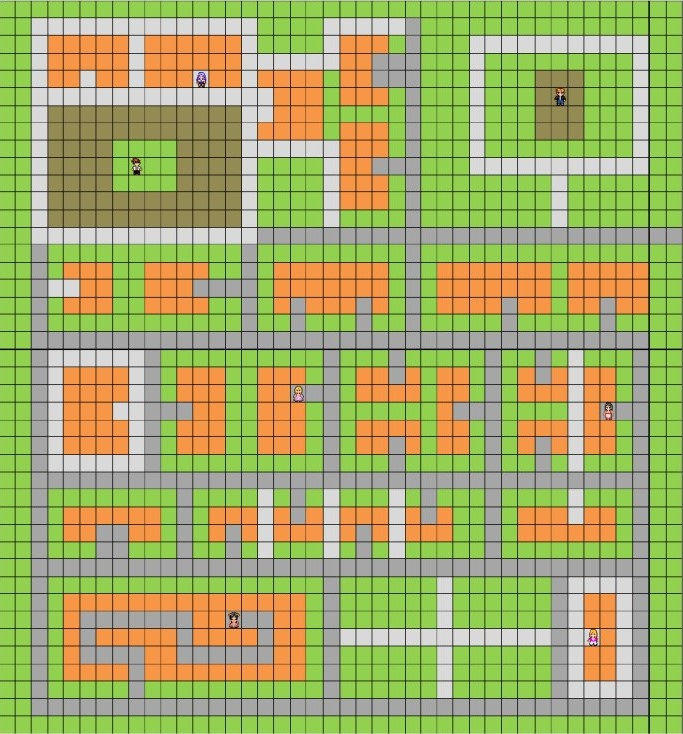

# Projeto Barbie Programadora

Este é um projeto desenvolvido para simular a jornada da Barbie em busca de se tornar a melhor programadora do mundo. O objetivo é implementar um agente capaz de locomover-se autonomamente pelo Mundo da Barbie, explorar os diversos ambientes e convencer três pessoas a participar do Concurso Mundial de Desenvolvimento de Softwares. O agente deve calcular automaticamente a melhor rota, levando em consideração o terreno, e retornar até a Casa da Barbie.

## Descrição do Problema

A Barbie precisa convencer três pessoas a fazerem parte da equipe para participar do concurso mundial de programação. As pessoas são Suzy, Polly, Mary, Carly, Ken e Brandon, que estão localizadas em diferentes pontos do mapa. A Barbie começa sua jornada na Casa da Barbie e termina quando convencer três pessoas e retornar à sua casa.

### Mapa e Terrenos

O Mundo da Barbie é representado por uma matriz 42 x 42, onde existem cinco tipos de terrenos:

- Asfalto (região cinza escuro) - Custo: 1 min
- Terra (região marrom) - Custo: 3 min
- Grama (região verde) - Custo: 5 min
- Paralelepípedo (região cinza claro) - Custo: 10 min
- Edifícios (região laranja) - Não pode ser atravessada

### Regras e Considerações

- O agente só pode se mover na vertical e na horizontal (não pode andar na diagonal).
- As pessoas podem aceitar ou recusar o convite da Barbie, e o agente deve tentar convencer outras pessoas se o convite for recusado.
- A ordem em que as pessoas são convencidas afeta o custo total.
- O programa deve ser implementado usando o algoritmo de busca heurística A*.
- O programa deve exibir o custo do caminho percorrido pelo agente e o custo final.
- O mapa pode ser configurado a partir de um arquivo de texto ou diretamente no código.
- O programa pode ser implementado em qualquer linguagem.
- O trabalho deve ser feito individualmente e apresentado em aula.

## Implementação

Este projeto foi implementado em Java no Android Studio e utiliza o algoritmo A* com a heurística "Manhattan distance" para calcular a melhor rota.

## Requisitos

- Dispositivo Android com o aplicativo instalado.

## Como Importar o Projeto para o Android Studio

1. Abra o Android Studio em seu computador.
2. Selecione "Open an Existing Project" na tela inicial do Android Studio.
3. Navegue até a pasta onde você clonou ou baixou este repositório e selecione a pasta raiz do projeto.
4. Aguarde o Android Studio importar o projeto e resolver quaisquer dependências ausentes.
5. Após a importação bem-sucedida, você pode executar o projeto clicando no botão "Run" (Executar) na barra de ferramentas do Android Studio. Certifique-se de ter um dispositivo Android conectado ao computador ou um emulador configurado para testar o aplicativo.

  Agora você está pronto para começar a trabalhar com o projeto no Android Studio!

## Autor

Leonardo Yago Nascimento Silva

## Creditos
Docente: Cleon Xavier Pereira Júnior

Créditos citado pelo docente: https://edirlei.com/
